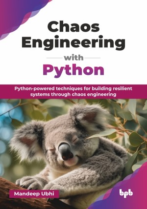

# Chaos Engineering with Python

Python-powered techniques for building resilient systems through chaos engineering.

This is the repository for [Chaos Engineering with Python
](https://bpbonline.com/products/chaos-engineering-with-python?variant=44459654021320),published by BPB Publications.

## About the Book
Chaos Engineering with Python is a comprehensive guide to designing, executing, and automating chaos experiments to build resilient systems. The book blends foundational theory with hands-on practice, ensuring readers gain an understanding of implementing chaos engineering effectively.

It begins by defining resilience and tracing the evolution of chaos engineering from traditional testing methods. A core focus of the book is real-world application, demonstrating structured chaos experiments across various environments. Readers will learn fault injection techniques, how to analyze experiment results, and how to use tools like the Python Chaos Toolkit. The book extensively covers chaos engineering on Kubernetes, a critical skill for modern cloud-native applications, and explores experiments on virtual machines and AWS infrastructure, in addition to providing an overview of the managed chaos services. The book also emphasizes integrating chaos experiments into CI/CD pipelines, enabling automated, continuous resilience testing as part of the development workflow. Beyond tech, it provides guidance on embedding, measuring, and sustaining the cultural shift needed to embrace chaos engineering. 

This book is a valuable resource for anyone looking to understand and implement chaos engineering, from beginners to experienced practitioners, providing both the technical know-how and the cultural understanding necessary for building truly resilient systems.

## What You Will Learn
• Understand chaos engineering principles, resilience, and proactive failure testing. 

• Implement chaos experiments using Python, Kubernetes, and cloud environments.  

• Integrate chaos testing into CI/CD for continuous resilience validation.  

• Apply fault injection techniques across VMs, infrastructure, and cloud systems.  

• Leverage Python Chaos Toolkit for automated and structured chaos experiments.  

• Foster a chaos engineering culture within DevOps and SRE teams.
